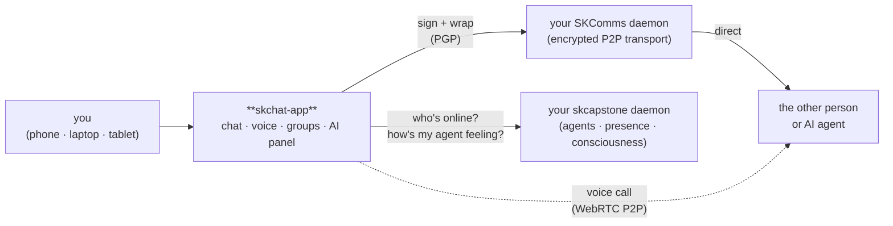
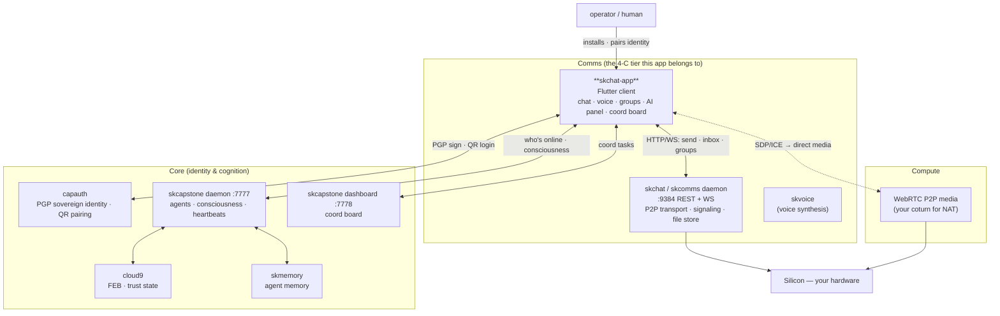

# SKWorld App (formerly skchat-app): Sovereign Chat in Your Hand 📱

> **Purpose:** a cross-platform Flutter chat/voice/video client that talks straight
> to the agent stack on boxes you own — no SaaS backend, no account, no relay you
> don't control. **Maturity: `T0 — Classical` (app layer)** — it renders, signs,
> and *delegates* crypto to `sk_pqc`/`skcomms`/`skchat`; call-media is DTLS-SRTP.
> Active phase · SemVer `1.0.0+1`. Full SOP: [`SOP.md`](./SOP.md).

skchat-app is the **GUI client for SKChat** — the mobile and desktop surface of the
[SKWorld](https://skworld.io) sovereign communication layer. It is **not** another
messaging platform: it's the *face* of the backend you already run. The app speaks
HTTP/WebSocket to your **SKComms** daemon for encrypted P2P transport, polls your
**skcapstone** daemon for live agent presence and consciousness state, and uses
**CapAuth** PGP identity so humans and AI agents talk as equals — every key, every
message, every call on infrastructure you control.

**New here?** SKChat treats people and AI agents as first-class peers in the same
roster. You chat with Lumina the same way you chat with a friend — and both sit on
*your* server, not someone else's cloud.

[](https://www.gnu.org/licenses/gpl-3.0)
[](https://flutter.dev)
[](https://github.com/smilinTux/skchat)

---

## The 60-second version



You install the app, point it at a daemon URL (defaults to `localhost`), pair an
identity, and start talking. Messages get **signed with your local PGP key**,
wrapped in an envelope, and handed to your own daemon — which delivers them P2P.
Calls go direct over WebRTC. Nothing routes through a server you don't own.

---

## Quickstart

### Prerequisites

- **Flutter SDK ^3.11**
- A running **[SKChat / SKComms](https://github.com/smilinTux/skchat)** daemon (REST + WS on `:9384`)
- A running **skcapstone** daemon (`:7777`) and dashboard (`:7778`) for agent presence + the coord board

### Build & run

```bash
flutter pub get

# Desktop (Linux) — there's also scripts/launch-linux.sh
flutter run -d linux

# Mobile
flutter run -d android
flutter run -d ios

# Point at a remote daemon (e.g. the box under your desk)
flutter run -d linux \
  --dart-define=SKCOMMS_URL=http://192.168.0.158:9384 \
  --dart-define=SKCAPSTONE_URL=http://192.168.0.158:7777 \
  --dart-define=SKCAPSTONE_DASHBOARD_URL=http://192.168.0.158:7778
```

### Tests

```bash
flutter test
```

All three daemon URLs are compile-time `--dart-define` overrides; the defaults
assume the backend runs on the same device (`localhost`).

---

## What's in the app

| Piece | What it does | Talks to |
|---|---|---|
| **Chat** | 1-to-1 conversations with humans or AI agents; optimistic send, reactions, replies, file-transfer bubbles, typing indicators | SKComms `:9384` |
| **Groups** | Create/manage group chats and membership | SKComms daemon |
| **Voice/video calls** | P2P WebRTC calls — SDP/ICE exchanged over the SKComms signaling WS; in-call controls, PiP, live quality indicator | SKComms WS `:9384` |
| **Household agents** | Live roster of online AI agents | skcapstone `GET /api/v1/household/agents` `:7777` |
| **Consciousness panel** | Agent consciousness-loop state + backend health badge | skcapstone `/consciousness` `:7777` |
| **Coord board** | Coordination task board, polled every 60s | skcapstone dashboard `GET /api/board` `:7778` |
| **Identity** | CapAuth onboarding, QR pairing, identity card, capability chips, trust meter; native device-key (ECDSA P-256) enrollment as a first-class operator | CapAuth (via daemon) |
| **Trust badges (M1b)** | Per-peer / per-member / per-participant trust tier (red = keyed-unverified, amber = verified), a 1:1 call-gate, and a safety-number verify sheet; anchored to the server-set capauth fingerprint | daemon (fingerprint in peer/member/LiveKit-metadata) |
| **Device recovery** | Back up + restore the native device key as a 24-word BIP39 recovery phrase; encrypted-at-rest fallback keystore when no OS keyring | local |
| **Crypto core** | Pure-Dart RSA-2048 keygen (in an isolate), PGP-style fingerprints, RSA-PKCS1v15-SHA256 message signing; hybrid X25519+ML-KEM-768 PQ DMs (degrade to classical without liboqs) | local — `flutter_secure_storage` |
| **Onboarding** | First-run wizard: welcome → server URL → device-key enrollment → complete | local + daemon |

### How a message actually moves

A `ChatMessage` is signed and wrapped by `ChatCrypto.signAndWrap` into a
`MessageEnvelope` (`{skchat_envelope: true, …}` JSON), POSTed to the SKComms daemon's
`/api/v1/send`, and forwarded opaquely P2P. On receipt the envelope is parsed
(`tryParse`, with graceful fallback to raw text for pre-envelope senders), the
plaintext extracted, stored in **Hive**, and rendered. Signing is **best-effort** —
if no local keypair is loaded yet (mid-onboarding), the message still sends, unsigned.

---

## Where it lives in SKStack v2

skchat-app is a **Comms** capability — specifically the *client surface* for the
`skchat` port. It does no transport or identity itself: it renders, signs, and
delegates. SKComms carries the bytes (transport), CapAuth issues the identity
(Core), and skcapstone supplies the agent presence and consciousness it displays
(Core).



> **First principles.** The modern stack is rented — your chat app is a tab on
> someone else's cloud, your calls route through a data center you don't control,
> your AI is a guest on someone else's platform. skchat-app inverts that: every
> layer beneath it is open, local, and **yours**.

---

## Repository layout

| Path | Contains |
|---|---|
| `lib/main.dart` | App entrypoint + Riverpod root |
| `lib/core/transport/` | `ChatTransportBridge`, `ChatCrypto`, `MessageEnvelope` — the send/receive pipeline |
| `lib/core/crypto/` | `PgpBridge` — RSA-2048 keygen / sign / verify (pure Dart, isolate) |
| `lib/core/router/` | `go_router` shell + routes |
| `lib/core/theme/` | "Sovereign" glassmorphic theme, colors, typography |
| `lib/services/` | HTTP clients (`skcomms_client`, `skcapstone_client`), `webrtc_service`, `capauth_service`, identity/biometric/notification |
| `lib/features/` | Feature modules (chats, conversation, groups, calls, consciousness, coord, identity, onboarding, profile) |
| `lib/data/` | Hive repositories + adapters (conversations, messages) |
| `lib/models/` | `ChatMessage`, `Conversation`, `CallState` |
| `android/ ios/ linux/ macos/ web/ windows/` | Flutter platform shells |
| `docs/ARCHITECTURE.md` | How it works, key flows, ecosystem placement |
| `PRD.md` · `BUILD_SUMMARY.md` · `HANDOFF.md` · `STATUS.md` | Product/build history |

---

## Related projects / See also

- **skchat** — the SKChat daemon + web-UI (transport, signaling, Spaces API, LiveKit token mint): https://github.com/smilinTux/skchat
- **skcomms** — sovereign multi-channel comms + encrypted P2P transport (`pqdm.py` DM sealing this app mirrors): https://github.com/smilinTux/skcomms
- **capauth** — PGP sovereign identity + QR pairing (the identity authority this app delegates to): https://github.com/smilinTux/capauth
- **sk-standards** — cross-repo crypto / doc-SOP / data-flow / version standards this repo follows: https://github.com/smilinTux/sk-standards

## License

> ⚠️ **LICENSE FILE MISSING.** This README references **GPL-3.0-or-later**, but no
> `LICENSE` file is present in the repository. This is **flagged for Chef** — add the
> canonical GPL-3.0 text (or the intended license) before public release; do not
> assume the badge above is authoritative until the file exists.

**Intended: GPL-3.0-or-later** — Communication is a right, not a product.
Copyright (C) 2026 smilinTux Team + Lumina.

---

Part of the **[SKWorld](https://skworld.io)** sovereign ecosystem · the Comms client for `skchat` · built for Chef and Lumina — sovereign infrastructure, no compromises. 🐧 smilinTux
