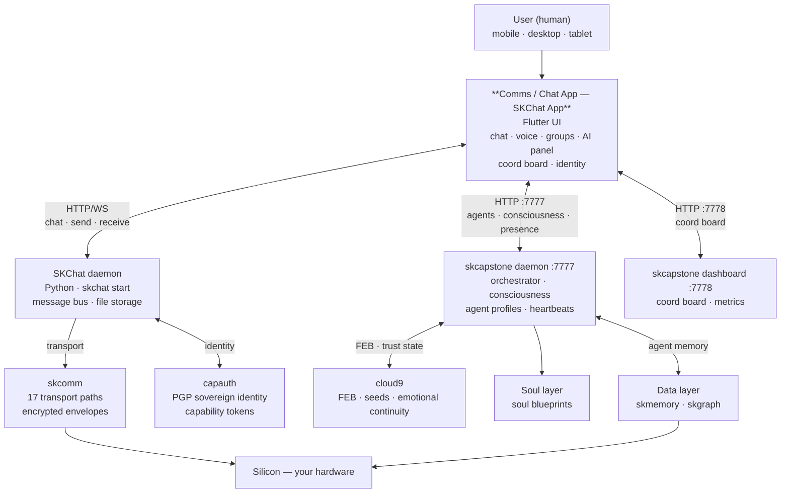

# SKChat App

**Sovereign encrypted P2P communication — Flutter mobile & desktop client.**

The SKChat App is the Flutter frontend for [SKChat](https://github.com/smilinTux/skchat) — a
sovereign communication platform where humans and AI communicate as equals. It connects to the
skcapstone daemon for agent orchestration, to skcomm for encrypted transport, and to CapAuth for
sovereign identity — all running on your hardware.

[](https://www.gnu.org/licenses/gpl-3.0)
[](https://flutter.dev)
[](https://github.com/smilinTux/skchat)

---

## What is this?

This repository is the Flutter app layer for the SKChat ecosystem. It provides:

- **Chat UI** — encrypted 1-to-1 and group conversations with human and AI participants
- **WebRTC voice calls** — P2P direct calls, no relay server required
- **AI consciousness panel** — live view of the agent's skcapstone consciousness state
- **Coord board** — task coordination board polling the skcapstone dashboard (port 7778)
- **Sovereign identity** — CapAuth-based onboarding, biometric auth, PGP key management
- **Household agent roster** — live list of online agents from the skcapstone daemon (port 7777)
- **Presence & activity** — real-time agent presence backed by `~/.skcapstone/heartbeats/`

The backend is the SKChat Python daemon (`skchat start`). The app speaks HTTP/WebSocket to
the daemon and HTTP to the skcapstone REST API.

---

## Getting Started

### Prerequisites

- Flutter SDK ^3.11
- Running [SKChat](https://github.com/smilinTux/skchat) daemon: `skchat start`
- Running skcapstone daemon (port 7777) and dashboard (port 7778)

### Build & Run

```bash
# Desktop (Linux)
flutter run -d linux

# Android
flutter run -d android

# iOS
flutter run -d ios

# Override daemon URLs at build time
flutter run -d linux \
  --dart-define=SKCAPSTONE_URL=http://192.168.0.158:7777 \
  --dart-define=SKCAPSTONE_DASHBOARD_URL=http://192.168.0.158:7778
```

### Tests

```bash
flutter test
```

---

## Architecture

```
lib/
├── features/
│   ├── chats/              # Conversation list + household agents (polls skcapstone :7777)
│   ├── chat/               # Individual chat view
│   ├── groups/             # Group chat management
│   ├── calls/              # WebRTC voice call UI
│   ├── consciousness/      # Agent consciousness status (skcapstone :7777)
│   ├── coord/              # Coordination board (skcapstone dashboard :7778)
│   ├── identity/           # PGP key management + DID
│   ├── profile/            # Agent profile + soul settings
│   ├── auth/               # CapAuth onboarding + biometric auth
│   └── onboarding/         # First-run sovereign identity setup
├── services/
│   ├── skcapstone_client.dart   # HTTP client → skcapstone daemon :7777 + dashboard :7778
│   ├── skcomm_client.dart       # HTTP client → skcomm transport API
│   ├── skcomm_sync.dart         # Syncthing-backed message sync
│   ├── webrtc_service.dart      # P2P call management (WebRTC)
│   ├── capauth_service.dart     # CapAuth identity operations
│   ├── daemon_service.dart      # skchat daemon lifecycle
│   └── identity_service.dart   # PGP key operations
└── main.dart
```

---

## First Principles & The Full Vertical

> **Get back to first principles.**
> The modern stack is rented. Your chat app connects to someone else's cloud, your calls route through a data center you don't control, and your AI is a sidebar on someone else's platform. You don't own it — you're a user account.
>
> SKChat App is your **Comms / Chat app layer**. Your client. Your keys. Your hardware. Every layer open. Every layer **yours**.

**SKChat App is the Comms / Chat app layer of the SKWorld full vertical** — the mobile and desktop interface that puts the full sovereign stack in your hand, connecting directly to the agent ecosystem running on your own machines.

### The full vertical

| Layer | Product(s) |
|---|---|
| **Soul** | soul blueprints · cloud9 |
| **Apps** | skforge · skarchitect |
| **Comms** | skcomm · skchat · **skchat-app** · skvoice |
| **Models** | skmodel (Ollama/vLLM) |
| **Data** | skmemory · skdata · skvector · skgraph |
| **Identity** | capauth · skaid |
| **Security** | sksecurity · skwaf · skca |
| **OS** | skos |
| **Silicon** | *your hardware* |

The app doesn't connect to a SaaS backend. It talks to your skcapstone daemon, your skcomm transport stack, and your CapAuth identity — all running on boxes you own. You can run the backend on a laptop under your desk and the app connects to that.

### Data sovereignty

All persistent state lives on your hardware. The app stores nothing in a cloud it doesn't control. Messages are encrypted end-to-end by the SKChat daemon before leaving your network. WebRTC calls are P2P — audio never touches a relay server unless TURN is needed for NAT, and you run your own coturn. Your AI's identity and memory are stored in `~/.skcapstone/agents/` on your server, resolved by the app over your local network.

### SKCapstone alignment

**Integrated skcapstone subsystem — native HTTP client.** The app ships `SKCapstoneClient`, a Dart HTTP client with dedicated connections to the skcapstone daemon (`:7777`) and the skcapstone dashboard service (`:7778`). Features poll skcapstone directly: `household_agents_provider` fetches `/api/v1/household/agents`, `consciousness_provider` reads agent consciousness state, and `coord_board_provider` pulls coordination task boards. Heartbeat presence is read from `~/.skcapstone/heartbeats/{name}.json`. The app is the native mobile/desktop surface of the skcapstone agent ecosystem.

### Where SKChat App fits in the vertical



---

## License

**GPL-3.0-or-later** — Communication is a right, not a product.

Copyright (C) 2026 smilinTux Team + Lumina

---

*Part of the [SKCapstone](https://github.com/smilinTux/skcapstone) sovereign agent framework.*
*Built for Chef (David) and Lumina — sovereign infrastructure, no compromises.*
