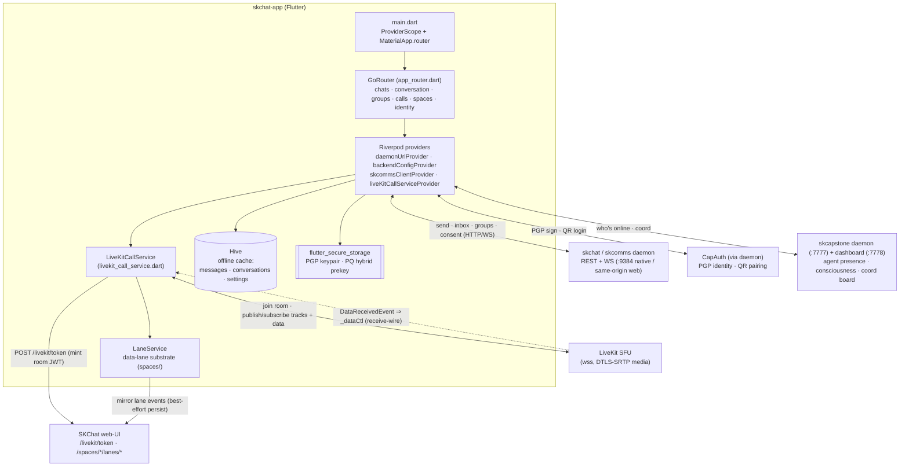

# skchat-app — Standard Operating Procedures

The Flutter GUI client for **SKChat** — the mobile/desktop/web surface of the
SKWorld sovereign comms layer. It renders, signs, and delegates: it does no
transport, identity, or crypto of its own — it speaks HTTP/WS to a **skchat /
skcomms** daemon, mints room tokens against the SKChat web-UI, joins **LiveKit**
SFU rooms for calls + data-lanes, and caches offline state in **Hive**.

## 1. Overview

**Purpose.** A cross-platform (Android / iOS / Linux / macOS / Windows / web)
Flutter client that gives a human or AI agent one surface for 1:1 chat, groups,
voice/video calls, Spaces (shared rooms with in-call chat / whiteboard / doc /
screen-share / watch lanes), agent presence, and the coord board.

**What it owns.**
- The UI + client-side state (Riverpod providers, GoRouter navigation).
- The send/receive rendering pipeline (`ChatCrypto` sign-and-wrap → `MessageEnvelope` → daemon POST → Hive).
- The LiveKit call/room client (`LiveKitCallService`) and the client half of the data-lane substrate (`LaneService` over the LiveKit data channel).
- At-rest storage of the operator's key material via `flutter_secure_storage` (PGP keypair, PQ hybrid prekey) and offline message/conversation cache via Hive.

**What it explicitly does NOT do.**
- No message transport of its own — every byte goes through the SKComms daemon.
- No identity issuance — CapAuth (via the daemon) is the identity authority.
- No owned crypto primitives — DM sealing/opening is delegated to `sk_pqc`
  (`PqDmCodec` mirrors `skcomms/pqdm.py`); PGP sign/verify uses `pointycastle`;
  the app is a **consumer** of these, not their author. Call-media confidentiality
  is provided by LiveKit's **DTLS-SRTP** leg, not by this app.

## 2. Architecture

The app is a thin Riverpod-wired Flutter front-end. Two backend planes: the
**SKComms daemon** (chat transport, signaling, groups, files, consent) reached
over HTTP/WS, and the **SKChat web-UI + LiveKit SFU** (room-token mint + real-time
audio/video + data-lanes). Offline state lives in Hive.



> **Lane substrate note.** In-call chat and the whiteboard/doc lanes are provided
> by the **upstream Spaces lane substrate** (`lib/features/spaces/` +
> `LaneService`), which publishes/subscribes lane events over the LiveKit data
> channel. `LaneService.inbound` maps over `LiveKitCallService.dataChannel`
> (backed by the private `_dataCtl` stream). **This session added the `_dataCtl`
> receive-wire** — a `Room` `EventsListener` that forwards every
> `DataReceivedEvent` into `_dataCtl` — so the lanes now *actually receive*.
> Before it, `sendData` published fine but no inbound lane event ever arrived
> (send-only). See §7 and §8.

**Start here** (the files to open first):
- `lib/main.dart` — app entrypoint; `ProviderScope` + `MaterialApp.router`; eagerly starts sync, loads the PGP identity, and bootstraps the PQ prekey.
- `lib/core/router/app_router.dart` — the GoRouter route table (chats, conversation, groups, calls, spaces, identity, onboarding).
- `lib/services/livekit_call_service.dart` — the LiveKit room client: token mint, join/leave, track controls, the data-channel send (`sendData`) **and the new `_dataCtl` receive-wire**.
- `lib/services/lane_service.dart` — the client data-lane substrate that rides the LiveKit data channel and mirrors to the server lane store.
- `lib/services/daemon_config.dart` / `lib/services/backend_config.dart` — runtime-settable daemon + backend URLs (the "point it at my box" knobs).

## 3. Build

Requires the **Flutter SDK ^3.11** (Dart ^3.11).

```bash
flutter pub get          # resolve dependencies
```

**Codegen.** The tree uses `freezed_annotation` in `pubspec.yaml`, but the
committed source is **hand-written — no generated `*.g.dart` / `*.freezed.dart`
files are checked in and none are required to build.** `build_runner` is *not*
part of the normal build. Only run it if you introduce new `@freezed` /
`json_serializable` types:

```bash
dart run build_runner build --delete-conflicting-outputs   # only if you add codegen
```

**Platform builds:**

```bash
flutter build web        # web bundle → build/web/
flutter build apk        # Android
flutter build linux      # desktop (also scripts/launch-linux.sh)
# ios / macos / windows likewise
```

> **Local dependency note.** `sk_pqc` is pinned via a `dependency_overrides`
> path (`../sk-pqc-dart`) relative to the checkout root. A worktree or clone that
> does not have a sibling `sk-pqc-dart/` will fail `pub get` — symlink or clone it
> next to the app checkout first.

## 4. Test

The gate is **analyze-clean + tests-green**:

```bash
flutter analyze          # static analysis — must be clean (info-level lints OK)
flutter test             # unit/widget tests — must pass
```

Both must pass before merge (see `CONTRIBUTING.md`). CI-equivalent local run:
`flutter pub get && flutter analyze && flutter test`.

## 5. Release / Deploy

Multi-platform Flutter client — there is no server to deploy, only artifacts to
build and (for web) to serve.

- **Native (mobile/desktop):** `flutter build <apk|ios|linux|macos|windows>` →
  ship the platform artifact. Point the build at a specific backend with
  `--dart-define` (see §6).
- **Web:** `flutter build web --release` produces a static bundle in
  `build/web/`. Serve it behind the SKChat web-UI reverse proxy.

**Front-end / exposure (mandatory).** The web build is served **behind the
funnel / tailnet** — the SKChat web-UI reverse-proxies `/api/v1`, `/daemon`,
`/access`, `/spaces`, and `/livekit/token` to the daemon, so the browser talks
**same-origin** and no daemon port is exposed. **Never** serve the web build on a
raw public port and **never** expose the daemon (`:9384`), LiveKit token endpoint,
or skcapstone (`:7777/:7778`) directly to the internet. Loopback-bound services
(e.g. skbloom `:8774`) are reached only via SSH/tailnet forward.

Versioning is SemVer via `pubspec.yaml` `version:` (`X.Y.Z+build`); tag + record
changes in `CHANGELOG.md` on release (see §9).

## 6. Configuration / Usage

**Daemon + backend URLs.** Two reactive config layers, both persisted in the
Hive `settings` box and both repointable at runtime from the Profile screen:

| Provider | Default | Override |
|---|---|---|
| `daemonUrlProvider` (`daemon_config.dart`) | native `http://localhost:9384`; **web = same origin** the app was served from | `--dart-define=SKCOMMS_URL=...` or Profile screen |
| `backendConfigProvider` (`backend_config.dart`) | web-UI `https://noroc2027.tail204f0c.ts.net`; LiveKit SFU `wss://localhost:8443`; skcapstone `:7777` / dash `:7778`; skbloom `:8774` | `--dart-define=SKCHAT_WEBUI_URL / LIVEKIT_URL / LIVEKIT_WEBUI_URL / SKCAPSTONE_URL / SKCAPSTONE_DASHBOARD_URL / SKBLOOM_URL` or presets |

Built-in **federation presets** (`kBackendPresets`): `lumina @ .158` and
`jarvis @ .41` repoint every backend (including the daemon URL) to one host.
`setCustomHost()` derives the whole stack from a single `scheme://host[:port]`.

Example (run against a remote box):

```bash
flutter run -d linux \
  --dart-define=SKCOMMS_URL=https://noroc2027.tail204f0c.ts.net \
  --dart-define=SKCAPSTONE_URL=http://noroc2027.tail204f0c.ts.net:7777
```

**Secure storage.** `flutter_secure_storage` holds, keyed:
- `pgp_public_key` / `pgp_private_key` / `pgp_fingerprint` — the local PGP identity (`identity_service.dart`).
- `pqc_hybrid_public_hex` / `pqc_hybrid_private_hex` / `pqc_hybrid_key_id` / `pqc_device_id` — the per-device PQ hybrid prekey (`pq_prekey_service.dart`).

Offline state (messages, conversations, settings) lives in Hive boxes; keys are
platform keystore-backed (Keychain / Keystore / libsecret / DPAPI).

## 7. API / Reference

**Key providers** (entry points for callers/tests):

| Provider | Role |
|---|---|
| `daemonUrlProvider` / `daemonWsUrlProvider` | live SKComms daemon HTTP + WS base |
| `backendConfigProvider` | live web-UI / LiveKit / skcapstone / skbloom URLs |
| `skcommsClientProvider` | REST/WS client to the daemon (send, inbox, groups) |
| `liveKitCallServiceProvider` | scoped `LiveKitCallService` (auto-disposes on config change) |
| `identityServiceProvider` / `identityKeyPairProvider` | local PGP identity load/save |
| `pqPrekeyServiceProvider` / `pqBootstrapProvider` | PQ hybrid prekey generate + publish |
| `spacesServiceProvider` | Spaces directory + room-token mint |
| `skCapstoneClientProvider` | agent presence, consciousness, coord board |

**LiveKit data-lane message shapes.** The Spaces lanes (upstream substrate,
`lib/features/spaces/`) exchange UTF-8 JSON over the LiveKit data channel via
`LaneService`. Every event carries a `"lane"` key; `LaneService.inbound` filters
on it. Observed shapes:

```jsonc
// chat lane        (space_chat_panel.dart)
{ "lane": "chat", "from": "<identity>", "text": "<string>", "ts": <epoch_ms> }

// whiteboard lane  (whiteboard_panel.dart) — snapshot: latest full state wins
{ "lane": "whiteboard", "from": "<identity>", "strokes": [ /* serialized strokes */ ] }

// doc lane         (doc_panel.dart)
{ "lane": "doc", ... }
```

`LiveKitCallService.sendData({topic, payload, reliable, destinationIdentities})`
publishes to the room; **`LiveKitCallService.dataChannel`** is the inbound
stream `({String topic, List<int> payload, String senderIdentity})`. That stream
is fed by the private `_dataCtl` **receive-wire added this session**: a
`Room` `EventsListener` `.on<DataReceivedEvent>` handler that forwards
`{topic, data, participant.identity}` into `_dataCtl`. Without it the lanes were
send-only. `LaneService.publish()` additionally best-effort mirrors each event to
`POST /spaces/{id}/lanes/event`, and `catchUp(lane)` replays persisted state from
`GET /spaces/{id}/lanes/{lane}/state` on join.

**Message pipeline.** `ChatCrypto.signAndWrap` → `MessageEnvelope`
(`{skchat_envelope: true, …}` JSON) → `POST /api/v1/send` on the daemon;
inbound envelopes are parsed (`tryParse`, graceful fallback to raw text),
cached in Hive, and rendered. DMs may additionally be sealed by `PqDmCodec`
(hybrid `x25519-mlkem768` KEM + HKDF-SHA256 + AES-256-GCM, via `sk_pqc`),
byte-for-byte interoperable with the daemon's `pqdm.py`.

## 8. Troubleshooting

| Symptom | Check |
|---|---|
| In-call chat / whiteboard shows my own messages but never peers' | The `_dataCtl` receive-wire (`_bindRoomListeners` in `livekit_call_service.dart`). If a build predates it, `dataChannel` never emits — lanes are send-only. |
| "daemon offline" on web after moving hosts | `daemonUrlProvider` seeds from the served origin; a stale persisted `settings/skcomms_daemon_url` (esp. one ending in `/api`) mis-routes. Reset via Profile or clear the Hive `settings` box. |
| `pub get` fails: `could not find package sk_pqc at "../sk-pqc-dart"` | `dependency_overrides` points at a sibling `sk-pqc-dart/`. Clone/symlink it next to the checkout root (worktrees resolve `../` from the worktree dir). |
| Calls connect but never see remote video/audio | LiveKit SFU URL (`backendConfigProvider.livekitUrl`) unreachable, or the server returned a `livekit_url` that routes off your tailnet. Verify `wss://…:8443` reachability. |
| Web build served but browser blocks daemon calls | Not behind the web-UI reverse proxy → mixed-content / CORS. Serve the bundle behind the funnel same-origin (§5), never a raw port. |
| Messages send unsigned | No local keypair loaded yet (mid-onboarding). Signing is best-effort; complete identity pairing (`identity_service.dart`). |
| PQ badge never shows / DMs stay classical | `pqBootstrapProvider` failed to publish the prekey, or the peer has no published prekey. Check `pq_prekey_service.dart` publish and the daemon's prekey store. |

## 9. Maturity-tier + Version reference

- **Maturity tier: `T0 — Classical` (app layer).** Per
  [`CRYPTOGRAPHY_STANDARD` maturity tiers](https://github.com/smilinTux/sk-standards),
  this app is a **crypto consumer, not a crypto owner**: it holds key material at
  rest in the platform keystore (PGP keypair; PQ hybrid prekey) and *invokes*
  hybrid sealing, but the primitives are **delegated** to `sk_pqc`, `skcomms`, and
  `skchat`. The DM lane it plumbs uses `sk_pqc`'s hybrid `x25519-mlkem768` KEM
  (a T2-class posture **owned by `sk_pqc`**, not asserted here). Call-media
  confidentiality is LiveKit **DTLS-SRTP** — a classical transport leg, stated
  honestly, not a post-quantum guarantee.
- **VERSION_LIFECYCLE phase:** Active (default, all new work) — see
  [`VERSION_LIFECYCLE`](https://github.com/smilinTux/sk-standards).
- **Version:** SemVer via `pubspec.yaml` `version:` (currently `1.0.0+1`).
  Bump + `CHANGELOG.md` entry + tag on release.

---

_Honest-claims note: no part of this repo is "quantum-proof", "quantum-safe", or
"unbreakable". Post-quantum protection is limited to the DM KEM surface provided
by `sk_pqc`; the call-media leg is DTLS-SRTP (classical)._
