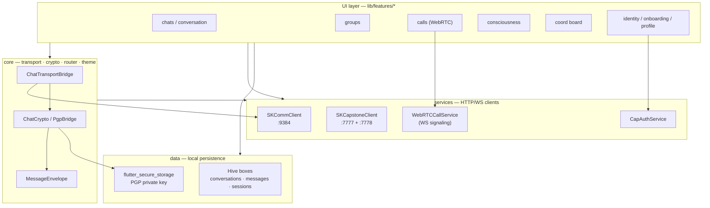
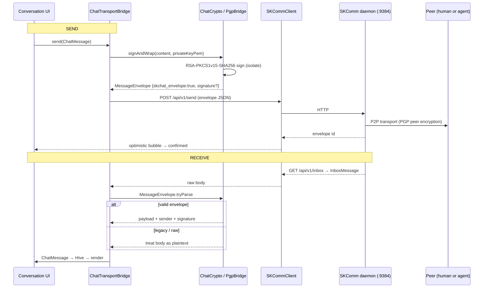
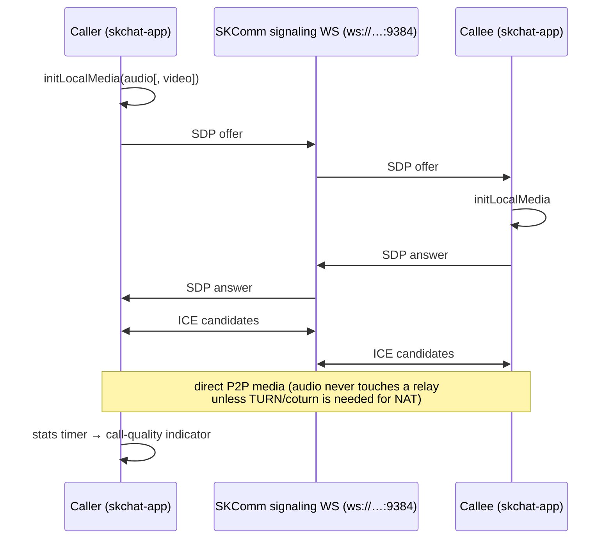
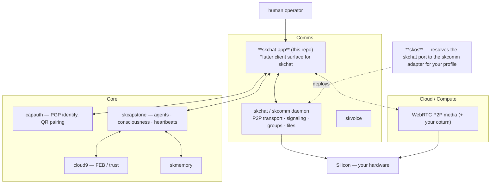

# skchat-app — Architecture

> The Flutter client for SKChat. It renders, signs, and delegates — every byte of
> transport, identity, and cognition lives in daemons you run. This doc explains the
> layers, the message and call flows, and where the app sits in SKWorld.

---

## 1. The shape of the app

skchat-app is a **thin sovereign client**: a Riverpod-driven Flutter UI over a small
set of HTTP/WebSocket clients. It holds no server logic. Three backends do the work,
and the app is a window onto them:

- **SKComm daemon** (`:9384`, REST + WS) — message send/receive, groups, file
  transfer, and WebRTC signaling.
- **skcapstone daemon** (`:7777`) — the agent roster, consciousness state, presence.
- **skcapstone dashboard** (`:7778`) — the coordination task board.

State management is **flutter_riverpod**; navigation is **go_router** with a shell
route driving the bottom-nav (chats / groups / activity / profile) plus full-screen
routes for conversation, identity, QR login, and the three call screens (outgoing /
incoming / active).

---

## 2. Key flow — sending and receiving a message

The full pipeline lives in `lib/core/transport/`. `ChatTransportBridge` coordinates
it; `ChatCrypto` does message-level signing on top of `PgpBridge`; `MessageEnvelope`
is the wire format the SKComm daemon forwards opaquely.

Notes grounded in the source:

- **Two crypto layers.** The SKComm daemon does *transport-layer* PGP encryption
  (peer key exchange). The app adds an independent *message-level* signature so a
  recipient can verify the sender from the Flutter keypair regardless of transport.
- **Best-effort signing.** If the local keypair isn't loaded (e.g. mid-onboarding),
  `signAndWrap` returns an unsigned envelope rather than blocking the send.
- **Graceful degradation.** `MessageEnvelope.tryParse` returns `null` for non-envelope
  bodies, so messages from pre-envelope senders display as raw plaintext.
- **Keygen** is RSA-2048 (`PgpBridge.generateKeyPair`), run in a Dart `Isolate` to keep
  the UI responsive (~1–3s on mobile). The private key lives in
  `flutter_secure_storage` (OS keychain / Keystore).

---

## 3. Voice/video calls (WebRTC)

`WebRTCCallService` manages a single peer connection. SDP offers/answers and ICE
candidates are exchanged over the SKComm signaling WebSocket; media then flows P2P.

The UI exposes outgoing / incoming / in-call screens, call controls, a
picture-in-picture overlay, and a live quality indicator driven by the WebRTC stats
stream.

---

## 4. Agent presence, consciousness, and the coord board

These are read-only polls of the skcapstone side via `SKCapstoneClient` (two `Dio`
instances — one per port):

| Provider | Endpoint | Port | Cadence |
|---|---|---|---|
| `householdAgentsProvider` | `GET /api/v1/household/agents` | 7777 | poll |
| `consciousnessProvider` | `GET /consciousness` | 7777 | poll |
| `coordBoardProvider` | `GET /api/board` | 7778 | every 60s |
| liveness | `GET /ping` | 7777 | health check |

This is what makes the app the *native surface of the agent ecosystem*: the same
roster shows humans and AI agents, and the consciousness panel + backend-health badge
reflect the live state of the agent you're talking to.

---

## 5. Source / content map

| Area | Files | Role |
|---|---|---|
| **Entrypoint** | `lib/main.dart` | Riverpod root, app bootstrap |
| **Transport pipeline** | `lib/core/transport/chat_transport_bridge.dart`, `chat_crypto.dart`, `message_envelope.dart` | send/receive, sign/verify, wire format |
| **Crypto** | `lib/core/crypto/pgp_bridge.dart` | RSA-2048 keygen / sign / verify, fingerprints |
| **Routing** | `lib/core/router/app_router.dart` | go_router shell + routes |
| **Theme** | `lib/core/theme/*` | sovereign glassmorphic theme, colors, typography |
| **Daemon clients** | `lib/services/skcomm_client.dart`, `skcapstone_client.dart`, `skcomm_sync.dart` | REST/WS to SKComm + skcapstone |
| **Calls** | `lib/services/webrtc_service.dart`, `lib/features/calls/*` | WebRTC peer connection + call UI |
| **Identity** | `lib/services/capauth_service.dart`, `identity_service.dart`, `biometric_service.dart`, `lib/features/identity/*`, `lib/features/auth/*` | CapAuth sessions, QR login, biometric gate |
| **Features** | `lib/features/{chats,conversation,groups,consciousness,coord,onboarding,profile,activity}/*` | UI modules + their Riverpod providers |
| **Persistence** | `lib/data/*` (Hive repos + adapters), `lib/models/*` | local conversation/message store, domain models |
| **Notifications** | `lib/services/notification_service.dart`, `notification_config.dart` | `flutter_local_notifications` |
| **Platform shells** | `android/ ios/ linux/ macos/ web/ windows/` | Flutter runners |

---

## 6. Where it lives in SKWorld

skchat-app is the *client* end of the `skchat` capability. The backend daemon is the
port; **skos** resolves that port to the SKComm adapter for the active profile
(personal → team → enterprise). The app's only contract is the three daemon URLs —
swap where they point and the same binary follows your infrastructure from a laptop
to a cluster.

---

Part of the **[SKWorld](https://skworld.io)** sovereign ecosystem · 🐧 smilinTux
